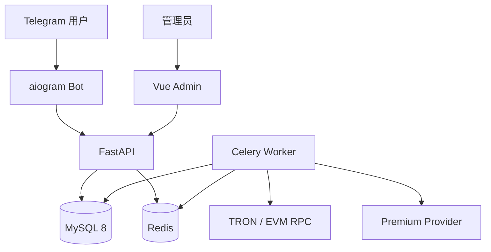
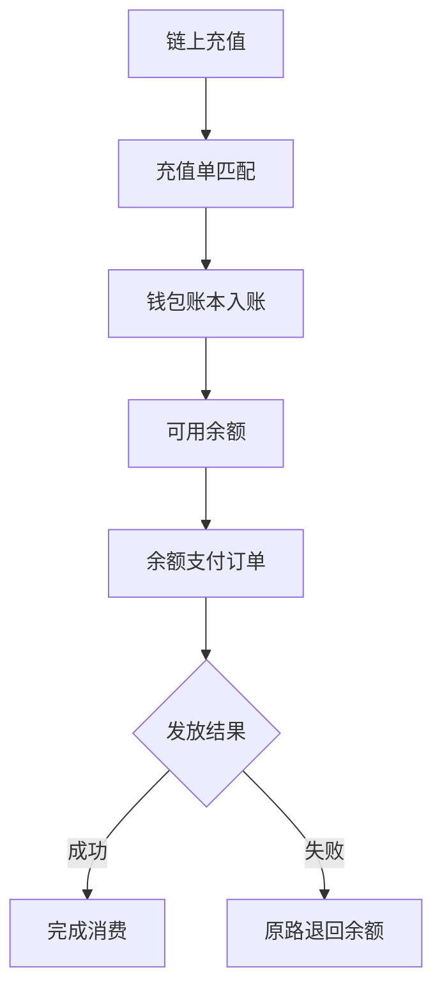
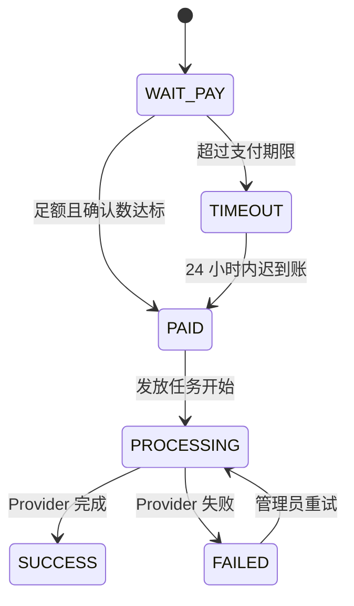

# 系统架构

## 服务边界

- Bot 不直接读写数据库，只通过带 `X-Internal-Token` 的内部 API 下单。
- FastAPI 负责认证、管理、状态查询和签名 Webhook。
- Worker 负责超时、链上扫描、发放、退款及回调，避免阻塞 HTTP。
- 管理后台只持有短期 JWT，不接触内部 Token、RPC 密钥或钱包机密。

## 用户钱包

`wallets` 表保存平台的链上公开收款地址；`user_wallets` 保存用户内部
USDT 余额，二者用途不同。每次余额变化都写入
`wallet_ledger_entries`，充值请求则记录在 `deposit_orders`。

- 充值按网络、收款地址和精确金额匹配，并以链上交易唯一键防止重复入账。
- 余额扣款与订单创建在同一数据库事务中完成，余额不足不会生成有效订单。
- 余额支付订单最终失败时自动写入退款流水；管理员重试前会重新扣款。
- `wallet_liability` 是所有用户可用余额之和，管理后台概览会单独显示。

## 订单状态机

所有状态变化写入 `order_status_history`。状态机在服务层强制执行，API、Webhook 和 Worker 无法绕过。

## 数据匹配

订单绑定：

1. 支付网络；
2. 收款地址；
3. 精确支付金额；
4. 创建时间窗口。

默认启用唯一尾数，例如套餐价 `29 USDT` 可能生成 `29.0371 USDT`，用于同一地址的并发订单匹配。若为每单分配唯一地址，可以关闭 `PAYMENT_UNIQUE_AMOUNT`。

链上交易以 `(network, tx_hash, log_index)` 唯一，充值账本另有幂等键，
重复扫描或 Webhook 重放不会重复入账。

## 扩展点

- `worker/payment/`：添加新链或第三方支付供应商。
- `services/premium.py`：实现新的 Premium 发放渠道。
- `services/refunds.py`：接入独立签名/托管退款服务。
- `services/callbacks.py`：扩展事件类型或消息队列。
